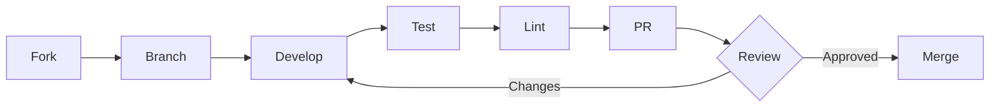

# Contributing to phpbu-docker

Thank you for your interest in contributing to phpbu-docker!

## Development Setup

### Prerequisites

- Docker with Buildx support
- Git

### Local Development

1. Clone the repository:
   ```bash
   git clone https://github.com/netresearch/phpbu-docker.git
   cd phpbu-docker
   ```

2. Build locally:
   ```bash
   docker buildx bake dev
   ```

3. Test your changes:
   ```bash
   docker run --rm phpbu:dev --version
   docker run --rm phpbu:dev --help
   ```

### Using Docker Compose

```bash
# Build and run
docker compose build phpbu
docker compose run --rm phpbu --version

# Development mode
docker compose up dev
```

## Making Changes

### Branch Naming

- `feature/` - New features
- `fix/` - Bug fixes
- `docs/` - Documentation updates
- `security/` - Security improvements

### Commit Messages

Follow [Conventional Commits](https://www.conventionalcommits.org/):

```
type(scope): description

[optional body]

[optional footer]
```

Types: `feat`, `fix`, `docs`, `style`, `refactor`, `test`, `chore`

Examples:
```
feat(dockerfile): add arm64 support
fix(security): run as non-root user
docs(readme): update usage examples
```

## Pull Request Process



1. **Fork** the repository
2. **Create** a feature branch from `main`
3. **Make** your changes
4. **Test** locally with `docker buildx bake ci`
5. **Lint** with hadolint: `docker run --rm -i hadolint/hadolint < Dockerfile`
6. **Submit** a pull request

### PR Requirements

- [ ] Dockerfile passes hadolint
- [ ] `docker buildx bake --print` validates bake file
- [ ] Every `composer.json` still agrees with its `composer.lock`
- [ ] Image builds successfully
- [ ] `--version` and `--help` work
- [ ] No new critical/high vulnerabilities (Trivy)
- [ ] Documentation updated if needed

## Testing

### Build Validation

```bash
# Validate bake configuration
docker buildx bake --print

# Build minimal variant (CI target)
docker buildx bake ci

# Build full variant (CI target)
docker buildx bake ci-full

# Run basic tests (minimal)
docker run --rm phpbu:ci --version
docker run --rm phpbu:ci --help

# Run basic tests (full)
docker run --rm phpbu:ci-full --version
docker run --rm phpbu:ci-full which rsync gpg ssh
```

### Composer Manifests

Both `app/` and `app/full/` are installed from their lock files during the image
build, so a constraint changed without regenerating the lock breaks the build
about ninety seconds in, as a bare `exit code: 4`. The same question takes a
second up front:

```bash
# Per manifest — repeat in app/ and app/full/
composer validate --check-lock --no-check-publish --strict
```

Two things can be wrong, and they need different fixes:

- **A named package** — `Required package "x/y" is in the lock file as "1.2.3"
  but that does not satisfy your constraint "^2.0"`. Re-resolve it:
  `composer update x/y`.
- **Only the content hash** — `The lock file is not up to date with the latest
  changes in composer.json`, with no package named. The lock still satisfies
  every constraint; refresh the hash with `composer update --lock`.

`composer update --lock` does *not* fix the first case: it rewrites the hash and
leaves the version mismatch behind, so `validate` still fails.

CI runs this over every tracked `composer.json` in `composer-validate.yml`.

### Security Scanning

```bash
# Run Trivy locally (minimal variant)
docker run --rm aquasec/trivy image phpbu:ci

# Run Trivy locally (full variant)
docker run --rm aquasec/trivy image phpbu:ci-full
```

### Lint Dockerfile

```bash
docker run --rm -i hadolint/hadolint < Dockerfile
```

## Code Style

### Dockerfile

- Use multi-stage builds
- Minimize layers
- Run as non-root user
- Add OCI labels
- Follow hadolint recommendations

### HCL (docker-bake.hcl)

- Use consistent indentation (2 spaces)
- Group related targets
- Document complex configurations

## Release Process

Releases are automated via GitHub Actions:

1. Create a tag: `git tag v1.0.0`
2. Push the tag: `git push origin v1.0.0`
3. CI builds, tests, signs, and pushes the image

## Getting Help

- **Issues**: [GitHub Issues](https://github.com/netresearch/phpbu-docker/issues)
- **Discussions**: [GitHub Discussions](https://github.com/netresearch/phpbu-docker/discussions)
- **Security**: [GitHub Security Advisories](https://github.com/netresearch/phpbu-docker/security/advisories/new)

## License

By contributing, you agree that your contributions will be licensed under the LGPL-3.0 License.
