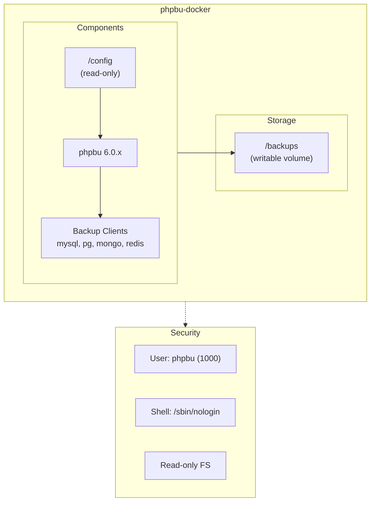

# phpbu Docker

[](https://github.com/netresearch/phpbu-docker/actions/workflows/build.yml)
[](https://github.com/netresearch/phpbu-docker/actions/workflows/security.yml)
[](https://securityscorecards.dev/viewer/?uri=github.com/netresearch/phpbu-docker)

Production-ready Docker image for [phpbu](https://phpbu.de/) - PHP Backup Utility with comprehensive backup, sync, and cleanup capabilities.

## Features

- **PHP 8.5** with security hardening
- **Non-root execution** (UID 1000, no login shell)
- **Multi-architecture** support (amd64, arm64)
- **Security-first design**:
  - Cosign-signed images with keyless OIDC
  - SBOM (Software Bill of Materials) included
  - SLSA Level 2 provenance attestation
  - Daily vulnerability scanning (Trivy, Docker Scout)
  - OpenSSF Scorecard monitoring
- **Pre-configured** for MySQL, PostgreSQL, MongoDB, Redis backups
- **Sync support** for S3, SFTP, Dropbox, Google Drive, Azure
- **Read-only filesystem** compatible

## Quick Start

```bash
# Pull the image
docker pull ghcr.io/netresearch/phpbu-docker:latest

# Verify signature (optional but recommended)
cosign verify ghcr.io/netresearch/phpbu-docker:latest \
  --certificate-identity-regexp "https://github.com/netresearch/phpbu-docker" \
  --certificate-oidc-issuer "https://token.actions.githubusercontent.com"

# Run a backup
docker run --rm \
  -v ./backup.json:/config/backup.json:ro \
  -v ./backups:/backups \
  ghcr.io/netresearch/phpbu-docker:latest \
  --configuration=/config/backup.json
```

## Architecture




## Usage

### Basic Backup with JSON Config

Create a `backup.json` configuration file:

```json
{
  "verbose": true,
  "backups": [
    {
      "name": "MySQL Backup",
      "source": {
        "type": "mysqldump",
        "options": {
          "host": "mysql",
          "user": "root",
          "password": "secret",
          "databases": "myapp"
        }
      },
      "target": {
        "dirname": "/backups",
        "filename": "mysql-%Y%m%d-%H%i%s.sql",
        "compress": "gzip"
      }
    }
  ]
}
```

Run the backup:

```bash
docker run --rm \
  -v ./backup.json:/config/backup.json:ro \
  -v ./backups:/backups \
  --network myapp_network \
  ghcr.io/netresearch/phpbu-docker:latest \
  --configuration=/config/backup.json
```

### Docker Compose (Recommended)

```yaml
services:
  phpbu:
    image: ghcr.io/netresearch/phpbu-docker:latest
    volumes:
      - ./config:/config:ro
      - ./backups:/backups
    environment:
      - TZ=UTC
    # Security hardening
    security_opt:
      - no-new-privileges:true
    read_only: true
    cap_drop:
      - ALL
    tmpfs:
      - /tmp:mode=1777,size=64M,noexec,nosuid,nodev
    depends_on:
      - mysql
    profiles:
      - backup
    command: ["--configuration=/config/backup.json"]

  mysql:
    image: mysql:8
    environment:
      MYSQL_ROOT_PASSWORD: secret
      MYSQL_DATABASE: myapp
    volumes:
      - mysql_data:/var/lib/mysql

volumes:
  mysql_data:
```

Run backup manually:

```bash
docker compose --profile backup run --rm phpbu
```

### Scheduled Backups

For scheduled backups, use the host's cron or a scheduler container:

```bash
# Add to crontab
0 2 * * * docker compose --profile backup run --rm phpbu
```

Or use Ofelia scheduler:

```yaml
services:
  scheduler:
    image: ghcr.io/netresearch/ofelia:latest
    volumes:
      - /var/run/docker.sock:/var/run/docker.sock:ro
    labels:
      ofelia.job-run.phpbu.schedule: "0 0 2 * * *"
      ofelia.job-run.phpbu.container: "phpbu"
```

## Configuration

### Environment Variables

| Variable | Description | Default |
|----------|-------------|---------|
| `TZ` | Timezone | `UTC` |

### Volume Mounts

| Path | Purpose | Mode |
|------|---------|------|
| `/config` | Configuration files | Read-only |
| `/backups` | Backup output directory | Read-write |

### Supported Backup Sources

| Type | Client | Package |
|------|--------|---------|
| MySQL/MariaDB | `mysqldump` | mysql-client |
| PostgreSQL | `pg_dump` | postgresql-client |
| MongoDB | `mongodump` | mongodb-tools |
| Redis | `redis-cli` | redis |

### Supported Sync Targets

- Amazon S3 / S3-compatible (MinIO, Wasabi, etc.)
- SFTP/SCP
- Rsync
- Dropbox
- Google Drive
- Azure Blob Storage
- OpenStack Swift

### Supported Cleanup Strategies

| Strategy | Description |
|----------|-------------|
| `capacity` | Keep backups up to specified size |
| `quantity` | Keep N most recent backups |
| `outdated` | Remove backups older than specified time |

## Examples

See the [examples/](examples/) directory:

- [`mysql-backup.json`](examples/mysql-backup.json) - MySQL database backup
- [`postgres-backup.json`](examples/postgres-backup.json) - PostgreSQL database backup
- [`s3-sync.json`](examples/s3-sync.json) - File backup with S3 sync

## Building

### Local Build

```bash
# Build for current platform (development)
docker buildx bake dev

# Build for all platforms
docker buildx bake

# Print build configuration
docker buildx bake --print
```

### Development

```bash
# Start development environment
docker compose up -d dev

# Run phpbu with custom config
docker compose run --rm phpbu --configuration=/config/backup.json

# Run tests
docker compose run --rm phpbu --simulate --configuration=/config/backup.json
```

## Security

### Container Security Features

| Feature | Implementation |
|---------|----------------|
| Non-root user | UID 1000, GID 1000 |
| No login shell | `/sbin/nologin` |
| Read-only filesystem | Supported |
| Dropped capabilities | `cap_drop: ALL` |
| No privilege escalation | `no-new-privileges` |
| Minimal base image | Alpine Linux |
| No build tools | Multi-stage build |

### Supply Chain Security

| Feature | Tool |
|---------|------|
| Image signing | Cosign (keyless OIDC) |
| SBOM generation | SPDX format |
| Provenance | SLSA Level 2 |
| Vulnerability scanning | Trivy, Docker Scout |
| Secrets detection | Gitleaks |
| Dependency updates | Dependabot, Renovate |
| Scorecard monitoring | OpenSSF Scorecard |

### Verify Image Signature

```bash
# Verify signature
cosign verify ghcr.io/netresearch/phpbu-docker:latest \
  --certificate-identity-regexp "https://github.com/netresearch/phpbu-docker" \
  --certificate-oidc-issuer "https://token.actions.githubusercontent.com"

# Download SBOM
cosign download sbom ghcr.io/netresearch/phpbu-docker:latest > sbom.spdx.json

# Verify provenance
cosign verify-attestation ghcr.io/netresearch/phpbu-docker:latest \
  --type slsaprovenance \
  --certificate-identity-regexp "https://github.com/netresearch/phpbu-docker" \
  --certificate-oidc-issuer "https://token.actions.githubusercontent.com"
```

See [SECURITY.md](SECURITY.md) for vulnerability reporting.

## Image Tags

Tags are based on **phpbu version**, not PHP version:

| Tag | Description | Example |
|-----|-------------|---------|
| `latest` | Latest build | `latest` |
| `6` | Latest phpbu 6.x | `6` |
| `6.0` | Latest phpbu 6.0.x | `6.0` |
| `6.0.30` | Specific phpbu version | `6.0.30` |
| `6.0.30-2026-01-22` | Version + build date | Immutable |
| `6.0.30-abc1234` | Version + git SHA | Immutable |

**Recommendation**: Use `6.0.30-2026-01-22` or `6.0.30-abc1234` for reproducible deployments.

## Architecture Support

| Platform | Status |
|----------|--------|
| `linux/amd64` | ✅ Full support |
| `linux/arm64` | ✅ Full support |

## Contributing

See [CONTRIBUTING.md](CONTRIBUTING.md) for guidelines.

### Development Setup

```bash
# Clone repository
git clone https://github.com/netresearch/phpbu-docker.git
cd phpbu-docker

# Install pre-commit hooks
pip install pre-commit
pre-commit install

# Build and test
docker buildx bake dev
docker run --rm phpbu:dev --version
```

## License

This project is licensed under the LGPL-3.0 License - see the [LICENSE](LICENSE) file for details.

phpbu itself is created by [Sebastian Feldmann](https://github.com/sebastianfeldmann) and licensed under the BSD-3-Clause license.

## Links

- [phpbu Documentation](https://phpbu.de/documentation.html)
- [phpbu GitHub](https://github.com/sebastianfeldmann/phpbu)
- [Container Registry](https://ghcr.io/netresearch/phpbu-docker)
- [Security Scorecard](https://securityscorecards.dev/viewer/?uri=github.com/netresearch/phpbu-docker)
