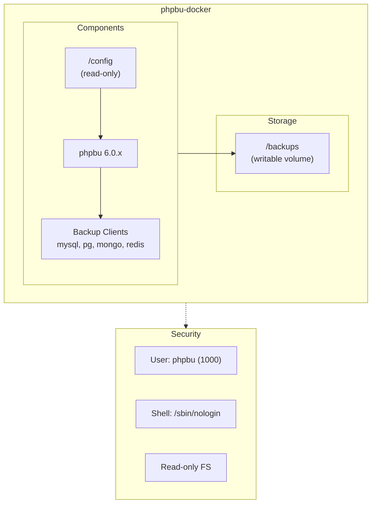

# phpbu Docker

[](https://github.com/netresearch/phpbu-docker/actions/workflows/build.yml)
[](https://github.com/netresearch/phpbu-docker/actions/workflows/test.yml)
[](https://github.com/netresearch/phpbu-docker/actions/workflows/security.yml)
[](https://securityscorecards.dev/viewer/?uri=github.com/netresearch/phpbu-docker)
[](https://slsa.dev)
[](https://opensource.org/licenses/LGPL-3.0)

Production-ready Docker image for [phpbu](https://phpbu.de/) - PHP Backup Utility with comprehensive backup, sync, and cleanup capabilities.

## Image Variants

| Variant | Tag | Size | Use Case |
|---------|-----|------|----------|
| **Minimal** | `latest`, `minimal` | ~50MB | Database backups only |
| **Full** | `full` | ~150MB | All sync adapters (S3, SFTP, Azure, etc.) |

```bash
# Minimal (recommended for most use cases)
docker pull ghcr.io/netresearch/phpbu-docker:latest

# Full (when you need cloud sync adapters)
docker pull ghcr.io/netresearch/phpbu-docker:full
```

## Features

- **PHP 8.5** on minimal Alpine base
- **Multi-architecture** support (amd64, arm64)
- **Pre-configured** for MySQL, PostgreSQL, MongoDB, Redis backups
- **Sync support** for S3, SFTP, Dropbox, Google Drive, Azure (full variant)
- **Container security**:
  - Non-root execution (UID 1000, no login shell)
  - Read-only filesystem compatible
  - Multi-stage build (no build tools in production)
  - Pinned base images for reproducibility
  - PHP hardening (disabled dangerous functions, secure defaults)
- **Supply chain security**:
  - Cosign-signed images with keyless OIDC
  - SBOM (Software Bill of Materials) included
  - SLSA Build Level 3 provenance attestation
  - Daily vulnerability scanning (Trivy)
  - OpenSSF Scorecard monitoring

## Quick Start

```bash
# Pull the image
docker pull ghcr.io/netresearch/phpbu-docker:latest

# Verify signature (optional but recommended)
cosign verify ghcr.io/netresearch/phpbu-docker:latest \
  --certificate-identity-regexp "https://github.com/netresearch/phpbu-docker" \
  --certificate-oidc-issuer "https://token.actions.githubusercontent.com"

# Run a backup
docker run --rm \
  -v ./backup.json:/config/backup.json:ro \
  -v ./backups:/backups \
  ghcr.io/netresearch/phpbu-docker:latest \
  --configuration=/config/backup.json
```

## Architecture


```mermaid
flowchart TB
    subgraph container["phpbu-docker"]
        subgraph components["Components"]
            config["/config<br/>(read-only)"]
            phpbu["phpbu 6.0.x"]
            clients["Backup Clients<br/>mysql, pg, mongo, redis"]
        end

        config --> phpbu
        phpbu --> clients

        subgraph storage["Storage"]
            backups["/backups<br/>(writable volume)"]
        end

        components --> backups
    end

    subgraph security["Security"]
        user["User: phpbu (1000)"]
        shell["Shell: /sbin/nologin"]
        fs["Read-only FS"]
    end

    container -.-> security
```


## Usage

### Basic Backup with JSON Config

Create a `backup.json` configuration file:

```json
{
  "verbose": true,
  "backups": [
    {
      "name": "MySQL Backup",
      "source": {
        "type": "mysqldump",
        "options": {
          "host": "mysql",
          "user": "root",
          "password": "secret",
          "databases": "myapp"
        }
      },
      "target": {
        "dirname": "/backups",
        "filename": "mysql-%Y%m%d-%H%i%s.sql",
        "compress": "gzip"
      }
    }
  ]
}
```

Run the backup:

```bash
docker run --rm \
  -v ./backup.json:/config/backup.json:ro \
  -v ./backups:/backups \
  --network myapp_network \
  ghcr.io/netresearch/phpbu-docker:latest \
  --configuration=/config/backup.json
```

### Docker Compose (Recommended)

```yaml
services:
  phpbu:
    image: ghcr.io/netresearch/phpbu-docker:latest
    volumes:
      - ./config:/config:ro
      - ./backups:/backups
    environment:
      - TZ=UTC
    # Security hardening
    security_opt:
      - no-new-privileges:true
    read_only: true
    cap_drop:
      - ALL
    tmpfs:
      - /tmp:mode=1777,size=64M,noexec,nosuid,nodev
    depends_on:
      - mysql
    profiles:
      - backup
    command: ["--configuration=/config/backup.json"]

  mysql:
    image: mysql:8
    environment:
      MYSQL_ROOT_PASSWORD: secret
      MYSQL_DATABASE: myapp
    volumes:
      - mysql_data:/var/lib/mysql

volumes:
  mysql_data:
```

Run backup manually:

```bash
docker compose --profile backup run --rm phpbu
```

### Scheduled Backups

For scheduled backups, use the host's cron or a scheduler container:

```bash
# Add to crontab
0 2 * * * docker compose --profile backup run --rm phpbu
```

Or use Ofelia scheduler:

```yaml
services:
  scheduler:
    image: ghcr.io/netresearch/ofelia:latest
    volumes:
      - /var/run/docker.sock:/var/run/docker.sock:ro
    labels:
      ofelia.job-run.phpbu.schedule: "0 0 2 * * *"
      ofelia.job-run.phpbu.container: "phpbu"
```

## Configuration

### Environment Variables

| Variable | Description | Default |
|----------|-------------|---------|
| `TZ` | Sets PHP `date.timezone` at container startup. Affects log timestamps and date-based backup filenames (e.g., `%Y%m%d` patterns). | `UTC` |

> **Note**: `TZ` is not compatible with `read_only: true` because the entrypoint writes
> a PHP config file at startup. For read-only containers, set the timezone at build time
> in a derived Dockerfile instead:
>
> ```dockerfile
> FROM ghcr.io/netresearch/phpbu-docker:latest
> RUN printf 'date.timezone = Europe/Berlin\n' > /usr/local/etc/php/conf.d/tz.ini
> ```

### Volume Mounts

| Path | Purpose | Mode |
|------|---------|------|
| `/config` | Configuration files | Read-only |
| `/backups` | Backup output directory | Read-write |

### Supported Backup Sources

| Type | Client | Variant |
|------|--------|---------|
| MySQL/MariaDB | `mysqldump` | minimal, full |
| PostgreSQL | `pg_dump` | minimal, full |
| MongoDB | `mongodump` | minimal, full |
| Redis | `redis-cli` | minimal, full |
| Tar archives | `tar` | minimal, full |

### Supported Sync Targets

| Target | PHP Package | Variant |
|--------|-------------|---------|
| Amazon S3 / S3-compatible | `aws/aws-sdk-php` | **full** |
| Google Cloud Storage | `google/cloud-storage` | **full** |
| Azure Blob Storage | `microsoft/azure-storage-blob` | **full** |
| SFTP | `phpseclib/phpseclib` | **full** |
| FTP | `sebastianfeldmann/ftp` | **full** |
| Dropbox | `kunalvarma05/dropbox-php-sdk` | **full** |
| Rsync | system binary | **full** |
| Local/NFS | - | minimal, full |

### Additional Tools (full variant only)

| Tool | Purpose |
|------|---------|
| `rsync` | Rsync sync target |
| `gpg` | Encryption support |
| `ssh` | SFTP/SCP connections |
| `curl` | HTTP operations |

### Supported Cleanup Strategies

| Strategy | Description |
|----------|-------------|
| `capacity` | Keep backups up to specified size |
| `quantity` | Keep N most recent backups |
| `outdated` | Remove backups older than specified time |

## Examples

See the [examples/](examples/) directory:

| Example | Description | Required Variant |
|---------|-------------|------------------|
| [`mysql-backup.json`](examples/mysql-backup.json) | MySQL database backup | `minimal` or `full` |
| [`postgres-backup.json`](examples/postgres-backup.json) | PostgreSQL database backup | `minimal` or `full` |
| [`s3-sync.json`](examples/s3-sync.json) | File backup with S3 sync | **`full`** |

## Building

### Local Build

```bash
# Build minimal variant (development)
docker buildx bake dev

# Build minimal variant for all platforms
docker buildx bake minimal

# Build full variant for all platforms
docker buildx bake full

# Build all variants
docker buildx bake

# Print build configuration
docker buildx bake --print
```

### Development

```bash
# Start development environment
docker compose up -d dev

# Run phpbu with custom config
docker compose run --rm phpbu --configuration=/config/backup.json

# Run tests
docker compose run --rm phpbu --simulate --configuration=/config/backup.json
```

## Security

### Container Security Features

| Feature | Implementation |
|---------|----------------|
| Non-root user | UID 1000, GID 1000 |
| No login shell | `/sbin/nologin` |
| Read-only filesystem | Supported |
| Dropped capabilities | `cap_drop: ALL` |
| No privilege escalation | `no-new-privileges` |
| Minimal base image | Alpine Linux |
| No build tools | Multi-stage build |

### Supply Chain Security

| Feature | Tool |
|---------|------|
| Image signing | Cosign (keyless OIDC) |
| SBOM generation | SPDX format |
| Provenance | SLSA Build Level 3 |
| Vulnerability scanning | Trivy |
| Secrets detection | Gitleaks |
| Dependency updates | Dependabot, Renovate |
| Scorecard monitoring | OpenSSF Scorecard |

### Verify Image Signature

```bash
# Verify signature
cosign verify ghcr.io/netresearch/phpbu-docker:latest \
  --certificate-identity-regexp "https://github.com/netresearch/phpbu-docker" \
  --certificate-oidc-issuer "https://token.actions.githubusercontent.com"

# Download SBOM
cosign download sbom ghcr.io/netresearch/phpbu-docker:latest > sbom.spdx.json

# Verify provenance
cosign verify-attestation ghcr.io/netresearch/phpbu-docker:latest \
  --type slsaprovenance \
  --certificate-identity-regexp "https://github.com/netresearch/phpbu-docker" \
  --certificate-oidc-issuer "https://token.actions.githubusercontent.com"
```

See [SECURITY.md](SECURITY.md) for vulnerability reporting.

## Image Tags

Tags are based on **phpbu version** and **variant**:

### Minimal Variant (default)

| Tag | Description |
|-----|-------------|
| `latest` | Latest minimal build |
| `minimal` | Alias for latest minimal |
| `6`, `6-minimal` | Latest phpbu 6.x (minimal) |
| `6.0`, `6.0-minimal` | Latest phpbu 6.0.x (minimal) |
| `6.0.30`, `6.0.30-minimal` | Specific phpbu version (minimal) |
| `6.0.30-2026-01-22` | Version + build date (immutable) |
| `6.0.30-abc1234` | Version + git SHA (immutable) |

### Full Variant

| Tag | Description |
|-----|-------------|
| `full` | Latest full build |
| `6-full` | Latest phpbu 6.x (full) |
| `6.0-full` | Latest phpbu 6.0.x (full) |
| `6.0.30-full` | Specific version (full) |
| `6.0.30-full-2026-01-22` | Version + build date (immutable) |
| `6.0.30-full-abc1234` | Version + git SHA (immutable) |

**Recommendation**: Use immutable tags (`6.0.30-2026-01-22` or `6.0.30-full-abc1234`) for reproducible deployments.

## Architecture Support

| Platform | Status |
|----------|--------|
| `linux/amd64` | ✅ Full support |
| `linux/arm64` | ✅ Full support |

## Contributing

See [CONTRIBUTING.md](CONTRIBUTING.md) for guidelines.

### Development Setup

```bash
# Clone repository
git clone https://github.com/netresearch/phpbu-docker.git
cd phpbu-docker

# Install pre-commit hooks
pip install pre-commit
pre-commit install

# Build and test
docker buildx bake dev
docker run --rm phpbu:dev --version
```

## License

This project is licensed under the LGPL-3.0 License - see the [LICENSE](LICENSE) file for details.

phpbu itself is created by [Sebastian Feldmann](https://github.com/sebastianfeldmann) and licensed under the BSD-3-Clause license.

## Links

- [phpbu Documentation](https://phpbu.de/documentation.html)
- [phpbu GitHub](https://github.com/sebastianfeldmann/phpbu)
- [Container Registry](https://ghcr.io/netresearch/phpbu-docker)
- [Security Scorecard](https://securityscorecards.dev/viewer/?uri=github.com/netresearch/phpbu-docker)
