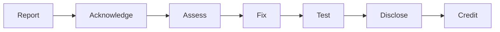

# Security Policy

## Scope

This security policy covers vulnerabilities in the **Docker image packaging** (Dockerfile, CI/CD, container configuration). For vulnerabilities in phpbu itself, please report to the [upstream phpbu project](https://github.com/sebastianfeldmann/phpbu/security).

## Reporting a Vulnerability

We take security vulnerabilities seriously. If you discover a security issue in the container image, please report it responsibly.

### How to Report

1. **Do NOT** create a public GitHub issue for security vulnerabilities
2. Use [GitHub Security Advisories](https://github.com/netresearch/phpbu-docker/security/advisories/new) to report privately
3. Include as much detail as possible:
   - Description of the vulnerability
   - Steps to reproduce
   - Potential impact
   - Suggested fix (if any)

### What to Expect



1. Acknowledgment of your report
2. Assessment of severity and impact
3. Development and testing of fix
4. Coordinated disclosure
5. Credit in release notes (if desired)

## Security Measures

This project implements the following security practices:

### Image Security
- Non-root user execution (UID 1000)
- Minimal Alpine-based image
- Multi-stage builds (no build tools in production)
- Daily vulnerability scanning with Trivy
- No secrets in image layers

### Supply Chain Security
- Signed images with Cosign (keyless OIDC)
- SBOM generation for dependency tracking
- SLSA Level 2 provenance attestation
- Dependabot for automated dependency updates
- Gitleaks scanning for secrets

### Build Security
- Pinned base images
- Composer dependencies from official sources
- Read-only filesystem support
- Security-opt no-new-privileges

## Verifying Image Signatures

```bash
# Verify image signature
cosign verify ghcr.io/netresearch/phpbu-docker:latest \
  --certificate-identity-regexp "https://github.com/netresearch/phpbu-docker" \
  --certificate-oidc-issuer "https://token.actions.githubusercontent.com"

# Download and verify SBOM
cosign download sbom ghcr.io/netresearch/phpbu-docker:latest > sbom.spdx.json
```

## Security Contact

Report vulnerabilities via [GitHub Security Advisories](https://github.com/netresearch/phpbu-docker/security/advisories/new).
